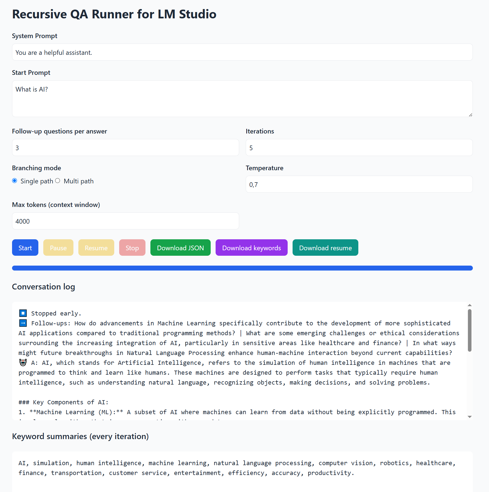

# LMStudio Brainstormer

A **single‑file** web app (`lmstudio-brainstormer.html`) that turns your locally hosted **LM Studio** model into a recursive brainstorming machine.

* Ask an initial question, let the app generate follow‑up questions, and iterate for as long as you like.
* Answers stream **live** into the conversation log.
* Keyword summaries are built after every iteration and an automatic résumé is produced at the end.
* Pause/Resume/Stop controls let you tweak parameters during a run.
* Everything stays local – no server, no build step, no external dependencies.

  

---

## Quick Start

1. **Run LM Studio**, load any chat model and enable *API Server* (default `http://localhost:1234`).
2. **Download** [`lmstudio-brainstormer.html`](./lmstudio-brainstormer.html) from this repo.
3. **Double‑click** the file – it opens in your browser and is ready to go.

> That’s it. There’s no cloning, no npm install, nothing – it’s just one HTML file.

---

## How to Use

1. **System Prompt** – the persona or behaviour guideline for your model.
2. **Start Prompt** – your first question/idea.
3. Set **follow‑ups per answer**, **iterations**, **temperature**, **max tokens**, and **branching mode**.
4. Hit **Start**. Answers stream in real time.
5. **Pause** to adjust settings, **Resume** to continue, **Stop** to end early.
6. Download the full JSON log, keyword list, or final résumé when done.

---
